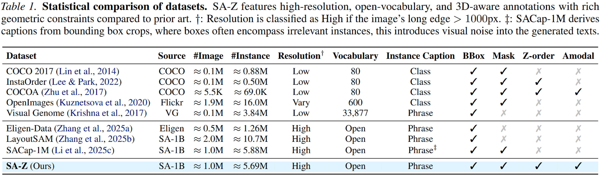
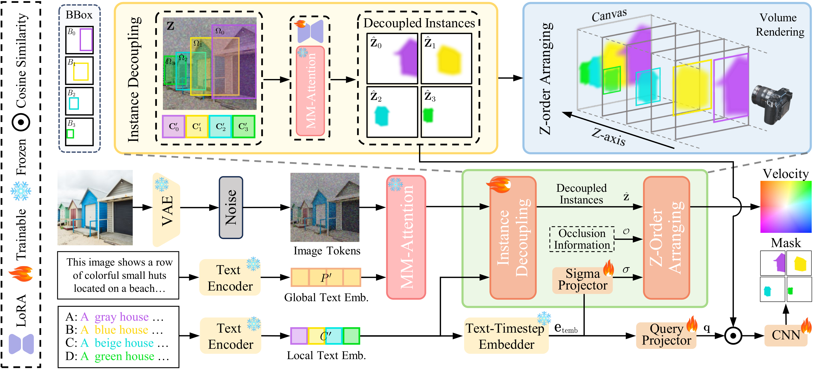

<h1 align="center" style="font-size:36px; line-height:1.05; font-weight:900; margin:0;">
  
  OcclusionFormer: Arranging Z-Order<br>for Layout-Grounded Image Generation
</h1>

<div align="center" style="margin-top:14px;">
<a href='https://henghuiding.com/OcclusionFormer/'></a> &nbsp;&nbsp;&nbsp;&nbsp;
<a href='[https://icml.cc/Downloads/2026](https://icml.cc/virtual/2026/poster/66159)'></a> &nbsp;&nbsp;&nbsp;&nbsp;
<a href='https://arxiv.org/'></a> &nbsp;&nbsp;&nbsp;&nbsp;
<a href='https://huggingface.co/FudanCVL/OcclusionFormer'></a> &nbsp;&nbsp;&nbsp;&nbsp;
<a href='https://huggingface.co/datasets/FudanCVL/SA-Z'></a>
</div>
<p align="center" style="margin:4px 0 0 0;">
  <a href="https://github.com/ZyLieee/" target="_blank" style="font-size:1.28em; font-weight:700;">Ziye Li</a>,
  <a href="https://henghuiding.com/" target="_blank" style="font-size:1.28em; font-weight:700;">Henghui Ding<sup>✉</sup></a>
</p>
<p align="center" style="margin:2px 0 0 0; font-size:1.35em; font-weight:600;">Fudan University</p>
<p align="center" style="margin:1px 0 0 0; font-size:1.48em; font-weight:900; color:#ff6a00;">ICML 2026</p>
<p align="center" style="margin:1px 0 0 0; font-size:1.08em; color:#6b7280;"><em>✉ Corresponding Author</em></p>

## 🔥 News
- [2026/05/18] Release **inference code**, **model weights** and **SA-Z dataset**.
- [2026/05/18] Release **OcclusionFormer open-source package** in this repository.
- [2026/4/30] OcclusionFormer is accepted to **ICML 2026**.

---


## 😊 Introduction

**OcclusionFormer** addresses a core challenge in layout-to-image generation: when multiple bounding boxes overlap, standard methods often produce entangled textures and incorrect front/back ordering.

From the paper, OcclusionFormer introduces explicit **Z-order modeling** for layout-grounded generation by:
- decoupling instance generation,
- arranging occlusion order with a volume-rendering-inspired transmittance mechanism,
- and enforcing spatial precision with a queried alignment objective.

The paper also introduces **SA-Z**, a large-scale dataset with explicit occlusion order and amodal supervision for occlusion-aware layout generation.

---

## 🔧 Key Features

- **SA-Z Dataset Curation:** Enriches layout annotations with instance captions, explicit occlusion order, and amodal signals.

- **Occlusion-Aware DiT Framework:** Models Z-order dependencies explicitly rather than mixing overlapping instances implicitly.
- **Instance Decoupling + Volumetric Composition:** Improves robustness on dense overlap scenes by composing instances with transmittance-based ordering.
- **Queried Alignment Mechanism:** Improves spatial faithfulness and local semantic consistency.



## 💻 Quick Start

1. Environment setup

```bash
cd OcclusionFormer
conda create -n OcclusionFormer python=3.11 -y
conda activate OcclusionFormer
```

2. Install requirements

```bash
pip install --upgrade -r requirements.txt
```

3. Download checkpoint

```bash
https://huggingface.co/FudanCVL/OcclusionFormer/main/occlusionformer to ./ckpt
```

4. Run Streamlit demo (Recommended)

```bash
streamlit run demo_occlusionformer.py
```

5. Run CLI inference

```bash
python inference_occlusionformer.py \
  --model_path /path/to/FLUX.1-dev \
  --ckpt_path /path/to/occlusionformer_checkpoint_dir \
  --layout_json ./examples/livingroom.json \
  --output_dir ./outputs_occlusionformer \
  --enable_layout \
  --overwrite
```

Batch inference with a directory of JSON layouts:

```bash
python inference_occlusionformer.py \
  --model_path /path/to/FLUX.1-dev \
  --ckpt_path /path/to/occlusionformer_checkpoint_dir \
  --layout_dir ./examples \
  --output_dir ./outputs_occlusionformer \
  --enable_layout \
  --overwrite
```

---
## ✅ TODO

- [ ] Organize and update the **Amodal annotation** on Hugging Face.

---
## 📁 Repository Scope

This folder provides a standalone inference/demo package:

- `demo_occlusionformer.py`: Streamlit demo UI
- `inference_occlusionformer.py`: CLI inference
- `src/occlusionformer/`: OcclusionFormer core modules
- `src/utils.py`, `src/transformer_utils.py`: required utility modules
- `examples/`: example layout JSON files
- `requirements.txt`: runtime dependencies

---

## ⚙️ Inference Notes

- The demo and CLI follow the current project preprocessing logic and compose prompts using global prompt + instance captions.
- Layout control is enabled via `--enable_layout` (or disabled with `--disable_layout`).
- Outputs include generated images and layout overlays for visualization.

---

## 👍 Acknowledgement

This work is built on many amazing research works and open-source projects. We thank the authors for sharing!

- [GLIGEN](https://github.com/gligen/GLIGEN)
- [InstanceAssemble](https://github.com/FireRedTeam/InstanceAssemble)
- [CreatiLayout](https://github.com/HuiZhang0812/CreatiLayout)

---

## 💗 Citation

```bibtex
@inproceedings{li2026occlusionformer,
  title={OcclusionFormer: Arranging Z-Order for Layout-Grounded Image Generation},
  author={Li, Ziye and Ding, Henghui},
  booktitle={ICML},
  year={2026}
}
```
